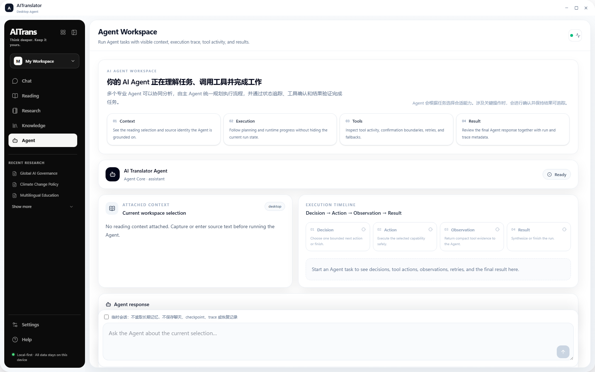
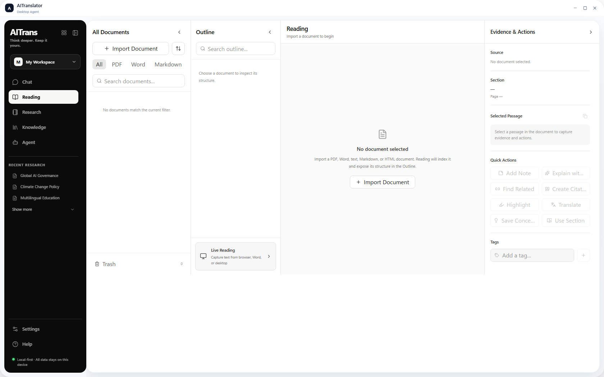
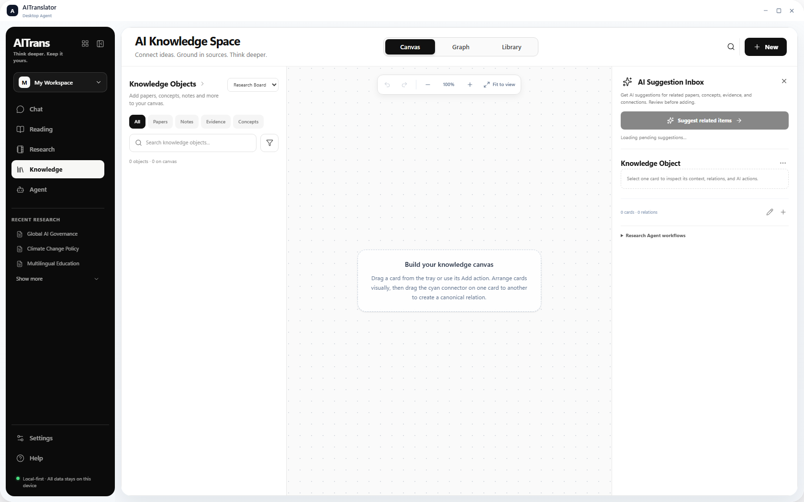
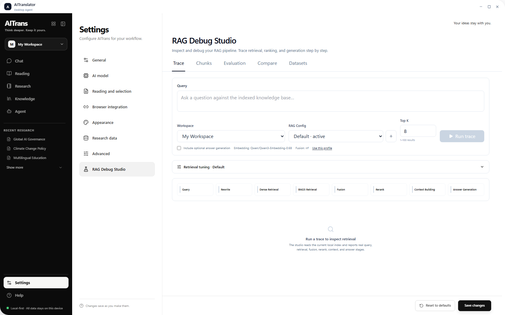

# AITrans

> Local-first AI Agent Workspace for reading, research, knowledge management, RAG, and multi-Agent execution.

[](https://github.com/mivaille777/AITrans/actions/workflows/ci.yml)

AITrans is a local-first **AI Agent Workspace** that brings document reading, research assistance, personal knowledge management, retrieval-augmented generation, and observable Agent execution into one desktop application.

The project started as a translation assistant and is evolving into a knowledge-centric research workspace built around:

- AI Chat and context-aware Agent interaction
- Multi-Agent orchestration with explicit runtime state
- Reading and academic document workflows
- Research evidence collection and synthesis
- Knowledge Library, boards, relations, and graph views
- Local RAG and retrieval debugging
- Translation as a reusable language capability
- Desktop integration with Tauri and browser reading context

中文简介：

> AITrans 是一个以知识空间为核心的本地化 AI Agent 工作平台。它将文献阅读、Research、Knowledge、RAG、多 Agent 协作、工具调用与上下文管理整合在同一工作流中，帮助用户完成从“读取信息”到“形成可复用知识”的全过程。

---

## Interface Preview

### Agent Workspace

The Agent workspace exposes task context, execution state, timeline, tool activity, decisions, artifacts, and final results instead of hiding execution behind a single chat response.

<p align="center">
  
</p>

### Reading & Knowledge

<table>
  <tr>
    <td width="50%" valign="top">
      
      <p align="center"><strong>Reading Workspace</strong></p>
    </td>
    <td width="50%" valign="top">
      
      <p align="center"><strong>Knowledge Workspace</strong></p>
    </td>
  </tr>
</table>

### RAG Debug Studio

RAG Debug Studio makes document import, chunking, retrieval, reranking, trace inspection, and runtime diagnostics visible during development.

<p align="center">
  
</p>

> Screenshots above are captured from the current `WebReBuild` implementation.

---

## Current Workspace

AITrans currently exposes the following primary routes:

| Workspace | Purpose |
| --- | --- |
| **AI Chat** | Continue reasoning from reading, research, and knowledge context. |
| **Agent** | Run Agent tasks with visible execution trace, tools, state, decisions, and results. |
| **Reading** | Read indexed documents and turn passages into evidence, notes, translations, or Agent context. |
| **Research** | Organize evidence and reopen research context for synthesis. |
| **Knowledge** | Manage cards, documents, boards, relations, graph views, and reusable knowledge. |
| **Translation** | Translate manual input or captured reading selections. |
| **Settings** | Configure model providers, local runtime, browser integration, local models, and RAG debugging. |

---

## Core Architecture

```text
                         AITrans Desktop
                  React 19 + TypeScript + Tauri
                              |
                              v
                       FastAPI Backend
                              |
             +----------------+----------------+
             |                |                |
             v                v                v
       Agent Runtime     Knowledge Runtime   RAG Runtime
       / LangGraph       / Research Data     / Retrieval
             |                |                |
             +----------------+----------------+
                              |
                   Local state and artifacts
             checkpoints / memory / evidence / traces
```

The architecture follows a separation-of-responsibilities model:

- **UI layer** presents workspace state, Agent progress, context, and results.
- **FastAPI layer** exposes typed APIs for Agent, reading, research, knowledge, RAG, translation, and settings.
- **Agent runtime** owns orchestration, workflow state, checkpoints, events, and bounded specialist execution.
- **Knowledge and Research runtimes** preserve reusable evidence and artifacts instead of treating every interaction as disposable chat.
- **RAG runtime** handles retrieval-oriented context construction and exposes a dedicated debugging surface.
- **Desktop layer** provides Tauri integration and browser/selection workflows.

---

## Multi-Agent System

The current Agent direction is centered on an authoritative graph that coordinates bounded specialist work:

```text
Authoritative Agent Graph
        |
        +-- Document Analyst
        +-- Research Synthesizer
        +-- Academic Writer
        +-- Knowledge Curator
        |
        +-- Shared language/tool capabilities
```

The root graph owns scope, budgets, checkpoints, events, memory snapshots, and final delivery. Specialists exchange typed tasks and versioned artifacts rather than relying on unrestricted mutable shared state.

Simple language work remains on a fast path; complex tasks can enter a specialist workflow.

Relevant runtime controls include:

```text
AITRANS_MULTI_AGENT_ROLLOUT=single|workflow|simple
AITRANS_MULTI_AGENT_ENGINE=legacy|off
```

The rollout switches are designed so changing orchestration modes does not delete user checkpoints or local data.

---

## Reading and Document Intelligence

Supported workflows include:

- PDF and text document reading
- Academic paper analysis
- Browser reading-context capture
- Passage selection and evidence extraction
- Translation and language assistance
- Research note generation
- Reading-to-Agent context handoff
- Reading-to-Knowledge reuse

Reading is treated as an upstream context and evidence source for Agent, Research, and Knowledge workflows.

---

## Knowledge Workspace

Knowledge is the reusable persistence layer of AITrans.

Typical flow:

```text
Import / Read Document
        |
        v
Extract Evidence
        |
        v
Create Knowledge Cards
        |
        v
Build Relations / Boards / Graph
        |
        v
Ask Agents with grounded context
        |
        v
Write useful results back to Knowledge
```

Current Knowledge capabilities include document indexing, cards, boards, relations, graph-oriented views, inspectors, suggestions, and Agent handoff/write-back flows.

---

## RAG and Retrieval

AITrans uses retrieval to construct grounded context instead of depending only on the model's parametric knowledge.

The current RAG development surface includes:

- document import
- chunk inspection
- retrieval
- reranking
- configurable top-k behavior
- trace inspection
- local embedding/reranker model management
- runtime diagnostics through **RAG Debug Studio**

Hardware-dependent Qwen3 embedding and reranker integration tests remain opt-in.

---

## Desktop Integration

AITrans supports desktop reading workflows through:

- Tauri desktop shell
- Browser Selection Bridge
- Reading Context Capture
- Native overlay interactions
- AI Chat / Agent handoff
- Research and Knowledge persistence

The browser and native desktop surfaces are treated as context-entry points rather than separate products.

---

## Technology Stack

| Layer | Main technologies |
| --- | --- |
| Desktop UI | React 19, TypeScript, Vite |
| Desktop shell | Tauri 2, Rust |
| Backend | Python 3.11+, FastAPI |
| Agent orchestration | LangGraph-oriented runtime |
| Testing | Pytest, Vitest, Testing Library, Clippy |
| Retrieval / Knowledge | Local RAG, vector retrieval, structured knowledge storage |
| CI | GitHub Actions with aggregated `CI quality gate` |

---

## Development

Main development branch:

```text
WebReBuild
```

Recommended environment:

```text
Python 3.11
Node.js 24
Rust stable
```

Start the local development environment:

```powershell
.\scripts\start.ps1
```

### Local verification

The repository provides a unified verification entry point:

```powershell
# Backend: dependency checks, Ruff critical rules, compile check, pytest
.\scripts\verify.ps1 -Scope Backend

# Frontend: lint, Vitest/type checks, production build
.\scripts\verify.ps1 -Scope Frontend

# Tauri: formatting visibility, Clippy, Rust tests, locked build
.\scripts\verify.ps1 -Scope Tauri

# Run all verification layers
.\scripts\verify.ps1 -Scope All
```

Use `-Install` when dependencies need to be installed or refreshed:

```powershell
.\scripts\verify.ps1 -Scope All -Install
```

---

## CI and Branch Quality Gate

Pull requests into `WebReBuild` and `main` are protected by the repository Ruleset and the aggregated **CI quality gate**.

The gate currently covers:

```text
CI quality gate
    |
    +-- Python tests (3.11)
    +-- Python quality
    +-- Python compatibility (3.12)
    +-- React lint, tests, and build
    +-- Tauri shell build
```

Feature development should normally use a short-lived branch and a pull request into `WebReBuild`.

---

## Architecture and Development Documents

- [Multi-Agent system design](docs/development/multi-agent-system-design.md)
- [Multi-Agent phased taskbook](docs/development/multi-agent-system-taskbook.md)
- [MA10 deterministic report](docs/development/ma10-deterministic-report.json)
- [Contributing guide](CONTRIBUTING.md)

Before migration or rollback, back up the local data root, especially checkpoint, artifact, memory, Knowledge, and Research SQLite databases.

Real Qwen3 GPU tests require PyTorch/CUDA and explicit `AITRANS_RUN_RAG_GPU_TESTS=1`. Real configured-LLM and manual-UI results are not claimed by deterministic regression reports.

---

## Roadmap

Current development direction includes:

- LangGraph-aligned multi-Agent orchestration and extensible specialist registration
- Stronger checkpoint, memory, and Agent state visualization
- Cross-stack end-to-end testing
- Real-model semantic A/B evaluation
- Multimodal RAG
- Skills and MCP management
- Long-term memory
- Knowledge Graph evolution
- More capable personal AI research workflows

---

## Project Evolution

```text
Translation Assistant
        |
        v
Reading Assistant
        |
        v
Knowledge Workspace
        |
        v
Observable Multi-Agent Workspace
        |
        v
Personal AI Research Assistant
```
