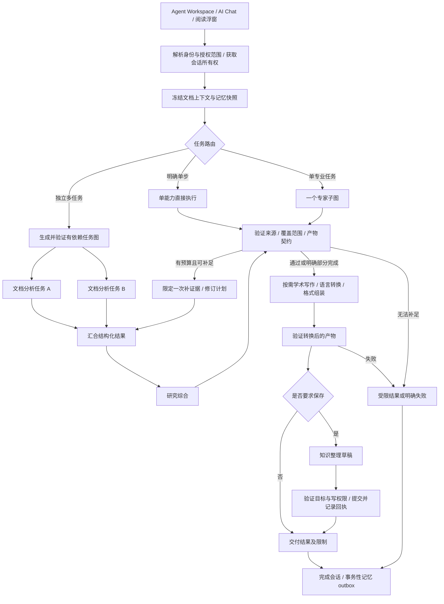

# AITrans 多 Agent 系统评估与架构设计

> 日期：2026-09-16；初始评估基线：`WebReBuild @ ad27691`；实现复验：2026-09-17 `4163845`。
> 适用定位：以个人知识工作区为核心的本地优先文档理解、研究辅助和知识管理产品。
> 状态：目标架构与 MA00–MA10 确定性门禁已实现；真实 Qwen3、真实配置 LLM、手工 UI 和三策略语义质量 A/B 尚未验证，因此本文仍不代表已测得多 Agent 质量提升。
> 开发执行入口：[多 Agent 分阶段任务书](multi-agent-system-taskbook.md)。记忆契约参见[记忆系统任务书](memory-system-taskbook.md)。

## 1. 设计结论与产品目标

推荐采用“一个权威任务调度图、四类可选择的专业执行器、共享证据与记忆服务”的结构。四类专业角色是文档理解、研究综合、学术写作和知识整理；一个角色可以有多个处理不同文档的实例。翻译、术语和润色作为共享语言能力。简单任务直接调用对应能力，复杂任务才生成有依赖关系的任务图。

这与项目 README 的定位一致：翻译是阅读与研究中的一项能力，最终产品价值是帮助用户理解材料、比较证据、形成结论并保存为可复用知识。架构的评价单位应是“用户任务是否有据可查地完成”，而不是启动了多少个 Agent。

最终用户体验：

- 划词翻译立即由语言能力执行，无关专业角色不启动。
- 阅读一篇论文时能定位到方法、实验、表格、局限及来源位置；只读取了局部材料时明确覆盖范围。
- 比较多篇文献时，独立文档分析可以并行，研究综合基于结构化证据比较条件、共识与分歧。
- “把比较结果整理成知识卡片”产生带来源的保存草稿，并通过现有写入路径保存；同一请求恢复时不重复生成卡片。
- “基于这些论文写 Related Work”产生带可追溯引用的章节草稿；“根据我的实验写结果章节”只使用用户已提供的实验数据，没有数据的位置保留待补项。
- 原文批注、阅读笔记、概念/方法/证据卡片可进入同一知识工作区；图谱关系先作为有依据的建议，接受后形成持久关系。
- 用户可看到真实子任务、进度、依赖、部分失败、证据覆盖和已保存对象；只有实际开始执行的角色才显示运行中。
- 中断后能恢复子任务进度；已删除记忆、撤销来源或更改工作区权限后，旧上下文不会重新进入模型。

范围不包含自治互联网爬取、Agent 相互无限对话、自动科研结论发布、替换现有知识数据库或默认启动云端后台任务。

首版论文写作交付“大纲、章节草稿、按段修订、引用清单、Markdown 导出”。完整排版投稿、Word 实时协作、期刊模板和实验数据分析平台属于后续范围，不能在首版完成说明中宣称支持。

## 2. 现有系统评估

### 2.1 实际生产调用链

`backend/api/agent_dependencies.py:get_agent_runtime()` 构造 request-scoped 的 `MultiAgentWorkspaceService` 和桥接器，再交给 `ReadingAgentGraph`。当前主路径如下：

```text
Agent API / WebSocket
  → AgentRuntime（可靠性、trace、取消、任务恢复）
  → ReadingAgentGraph
      resolve_context
      run_collaboration
        → 关键词判断是否启用协作
        → KnowledgeInjector 读取 Knowledge Graph
        → Research → Reading → Translation（按计划串行执行）
        → 收集结果，再集中转发协作事件
        → 将辅助结果拼入 context_before
      prepare_conversation
      route_request
      execute_direct 或 ReAct 工具循环
      finalize_conversation
```

现有多 Agent 是已接入生产的辅助前序工作流；主图仍掌握工具权限、证据检查、最终回答和会话提交。保留这个单一业务执行边界是正确的，升级时应把协作纳入其正式计划和子任务状态。

### 2.2 已具备、值得保留的能力

| 能力 | 代码依据 | 设计判断 |
| --- | --- | --- |
| 单一生产 Agent Runtime | `backend/agent_core/runtime.py`、`backend/api/agent_dependencies.py` | 继续作为业务入口，避免多个系统争夺最终回答和会话所有权 |
| 条件路由与 ReAct | `backend/services/agent_router_service.py`、`backend/agent_graph/reading_agent_graph.py` | 可复用为简单路由与受限专家子图，不必重写所有工具逻辑 |
| typed tools 和写入约束 | `backend/services/agent_tool_registry.py`、`backend/services/product_agent_service.py` | 所有专家工具调用必须经过同一权限、超时和追踪入口 |
| 本地 checkpoint | `backend/services/agent_checkpoint_service.py` | 保留 `run_id = thread_id`、严格序列化与现有未知写入效果恢复限制 |
| 会话和浮窗所有权 | `backend/services/agent_conversation_service.py` | 在发生专业执行和成本之前获取所有权，并覆盖取消/异常释放 |
| 文档 RAG 与证据核验 | `backend/services/agent_evidence_gate_service.py`、`backend/services/agent_claim_evidence_verifier.py` | 建立共享 EvidencePacket；现有词法核验是防线，不等于完整语义真实性证明 |
| 研究证据审阅与综述 | `backend/services/agent_literature_synthesis_service.py`、`docs/stage20-agent-literature-synthesis.md` | 继续执行人工 Review Gate；一般研究任务与正式 review-gated 综述严格区分 |
| 研究记忆及来源状态 | `backend/services/research_memory_service.py`、`backend/services/research_memory_reliability_service.py` | 复用 fresh/stale/orphaned/detached/conflict 信息，禁止重新造一份独立事实库 |
| 笔记与可审阅图谱关系 | `backend/agent_tools/research.py`、`backend/knowledge/service.py`、`backend/services/knowledge_relation_suggestion_service.py` | 复用现有 note CRUD、canonical items/relations 和 proposal/review，而不是把旧图快照当作唯一事实库 |
| 当前写作能力 | `backend/agent_tools/writing.py`、`backend/services/agent_literature_synthesis_service.py` | 已有选区润色和综述生成；尚不能据此认定已有完整论文写作 Agent，需增加大纲/章节/版本/引用契约 |
| 前后端事件链 | `backend/agent_core/events.py`、`backend/models/agent_tools.py`、`apps/desktop/src/api/agent.ts` | 在兼容基础上补 task ID、尝试次数、父子关系和真实时间线 |

### 2.3 关键缺口与影响

| 编号 | 发现 | 代码证据 | 影响与优先级 |
| --- | --- | --- | --- |
| F01 | 关键词决定角色，把原问题原封不动发给每个角色 | `backend/agent_core/multi_agent/orchestration/planner.py` | 未描述子目标、输入、依赖和完成条件；简单请求可能过度分派，复杂请求可能漏分派；P1 |
| F02 | Research 实际查询 ResearchNoteService；Reading 组织截断摘录；Translation 生成有限长度草稿 | `backend/agent_core/multi_agent/agents/`、`backend/api/agent_dependencies.py` | 三者有真实能力，但尚不是能够按明确证据契约交付的专业分析流程；P1 |
| F03 | 协作知识接口没有传入工作区/文档 scope；检索读取整张图，关系度可单独让无词匹配节点入选 | `context/knowledge_injector.py`、`backend/services/agent_knowledge_runtime.py`、`backend/services/agent_knowledge_retrieval.py` | 可绕开主知识检索的范围限制，并产生无关背景；在本次合成探针中已复现接口行为；P0 |
| F04 | 共享状态用可变字典；结果按 agent_name 保存 | `context/shared_context.py`、`orchestration/executor.py` | 同一专家处理两篇文档时后一个结果会覆盖同名结果；不适合并发和任务级恢复；P1 |
| F05 | 调度器串行 for 循环，整个协作是父图一个普通节点 | `orchestration/executor.py`、`backend/services/multi_agent_runtime_bridge.py` | 协作内部没有专家节点 checkpoint；内部中断时已做工作的重放风险与父节点粒度绑定；P1 |
| F06 | 协作只在外层检查 RunControl，专家直接调用业务服务 | `multi_agent_runtime_bridge.py`、`agents/translation_agent.py` | 专家没有显式领取共享 LLM/tool 预算及独立取消/超时契约；供应商自身可能有超时，不能据此宣称全局协作预算已覆盖；P1 |
| F07 | 事件先收集，等 service.run 返回后才 forward；degraded 未完整体现在完成事件中 | `multi_agent_runtime_bridge.py`、`orchestration/executor.py`、`trace.py` | 实时进度延后；“节点运行完”容易被理解为任务成功；P1 |
| F08 | 专家输出 JSON 按字符截断后拼入阅读 context_before | `multi_agent_runtime_bridge.py:_advisory_prompt_context()` | 辅助推导与原文周边上下文混杂；字段/引用可能截断；后续主图可能再次做相似翻译或检索，成本影响尚待 A/B 实测；P1 |
| F09 | 记忆默认在进程字典中，生产服务还按请求构造；桥接以 session_id 当 user_id | `context/memory_adapter.py`、`backend/api/agent_dependencies.py` | 默认生产路径不能提供可靠跨请求/跨会话记忆；P1 |
| F10 | 另有 SupervisorOrchestrator、AgentResultMerger、CollaborationProtocol 等原型 | `supervisor_orchestrator.py`、`orchestration/result_merger.py`、`protocol/` | 本次源码搜索只发现定义/导出，未发现生产调用；需逐项确认消费者再收敛，不能直接批量删除；P2 |
| F11 | 图快照、Knowledge V2 和 canonical KnowledgeWorkspace 并存，关系建议默认候选也可能取全库 | `backend/services/knowledge_graph_repository.py`、`backend/knowledge/v2_service.py`、`backend/knowledge/service.py`、`backend/services/knowledge_relation_suggestion_service.py` | 新 Curator 必须明确读写 canonical 对象并显式限定候选；不能另建第四套图或把旧快照全量合并；P1 |

表中 `context/`、`orchestration/`、`agents/`、`protocol/` 均相对 `backend/agent_core/multi_agent/`。P0 表示目标架构上线前必须先封闭的正确性/范围问题，不表示已发生真实用户数据泄漏。

### 2.4 本次验证结果及边界

本地版本：`langgraph 1.2.11`、`langgraph-checkpoint-sqlite 3.1.1`。执行以下既有测试：

```powershell
conda run -n aitrans python -m pytest tests/agent/test_multi_agent_stage5_6.py tests/agent/test_multi_agent_stage5_7.py tests/agent/test_multi_agent_stage5_8.py tests/agent/test_multi_agent_stage5_9.py tests/agent/test_agent_checkpoint_persistence.py tests/agent/test_agent_trace_event_contract.py -q
```

结果：**92 passed，7.73s**。说明已有协作、恢复及事件契约的测试通过；它们未证明新设计中的并发隔离、任务级恢复和质量收益。

针对用户补充的写作与图谱目标，另跑选区写作边界、图谱关系建议/API 和综述 Review Gate 四个测试文件，结果 **10 passed，4.97s**；完整命令见开发任务书第 4 节。本次共 102 项既有测试通过。

仅使用合成对象的只读探针得到：

| 输入/操作 | 当前输出 | 解释 |
| --- | --- | --- |
| `翻译这篇论文` | research、translation | 两个关键词即启动两种角色，未判断是否真的需要研究 |
| `比较 A 与 B 的实验差异` | research | 规划器只有默认 research；auto 桥接要求至少两种角色，因此不会为此请求启动该协作层，主 ReAct 仍可能处理 |
| `请总结并翻译这篇论文` | research、reading、translation，task 全部相同 | 没有指定“先总结再翻译摘要”或“全文翻译”等依赖/覆盖范围 |
| `你好` | 默认 research | auto 桥接不启用单角色计划，因此不能据此说生产聊天必定调用 Research |
| synthetic context 指定 workspace A/doc A，图中放带边的 B 标记节点，查询完全无关 | B 标记节点和另一节点均返回，score=0.05 | 实证接口忽略 scope 且关系加分可独立命中；未对真实用户图做越界测试 |
| adapter 1 保存，再新建 adapter 2 读取同一测试 profile | `{}` | 默认存储随对象生命周期丢失 |

以上为 2026-09-16 初始基线记录；当时未调用付费模型评判回答质量、未测真实任务加速率，也未修改 Agent 运行代码。当前实现状态见下一节。

### 2.5 2026-09-17 实现后状态

生产入口仍只有一个 `AgentRuntime → ReadingAgentGraph`。新的可信 scope resolver、typed TaskPlan、Document/Research/Writer/Curator 专家子图、共享 Language 能力、版本化 artifact、受限并发调度、任务 checkpoint、实时事件、MemoryCoordinator 和 Research UI 均已接入这一根图，没有建立第二套会话或最终回答所有权。

```text
Agent API / WebSocket / Research UI
  → AgentRuntime（trace、取消、恢复、会话所有权）
  → ReadingAgentGraph（唯一根图）
      → authoritative scope + memory snapshot + budget
      → fast | single | workflow
          → Document / Research / Writer / Curator 子图
          → shared Language tools
      → verified versioned artifacts / explicit business commits
      → final delivery and persistent task events
```

MA10 的 deterministic T01–T36 契约矩阵为 36/36，通过完整 Python、桌面端和 Tauri 门禁。公平 A/B 调度和 recorded-input 协议已经具备，但当前没有真实三策略语义观测；usage 未知时写 `null`，不写假零。发布策略因此采用 `AITRANS_MULTI_AGENT_ROLLOUT=single` 默认值，复杂 workflow 仅显式启用。完整边界和报告见[任务书 MA10 记录](multi-agent-system-taskbook.md#ma10-实施记录--2026-09-17)与[确定性报告](ma10-deterministic-report.json)。

旧 `AgentPlanner/AgentExecutor` 仍由 legacy 迁移桥生产使用；旧 checkpoint 解释器也处于兼容期。本阶段保留这些代码和历史数据。回滚可按 `workflow → single → simple → legacy/off` 收紧运行面，切换前应备份 checkpoint、artifact、memory、Knowledge 与 Research SQLite 文件。

## 3. 设计理念与合理性

### 3.1 按职责和产物分工

只有存在不同的目标、工具集合、上下文边界或验证方法时，才建立专业角色。检索、OCR、向量化、重排、记忆读写都是共享服务；把每个服务再包装成自主 Agent 会增加调度成本和状态复杂度。

对比文献适合分解，因为各文档的阅读产物可独立产生，随后进行比较。翻译一个段落一般无需多专家共同推理。保持这一差异，能把并行资源用在真正独立的工作上。

外部经验支持受控的 orchestrator-worker 模式，并强调明确子任务和避免重复检索的重要性，但不能把其他产品的收益数字当成本项目结果。[Anthropic 多 Agent 研究系统工程说明](https://www.anthropic.com/engineering/multi-agent-research-system)

### 3.2 保留一个权威调度图

Supervisor 是受代码约束的路由/规划能力，由 LangGraph 节点调度；它不是另一个能够跳过工具策略的超级角色。唯一根图拥有 conversation/run 的状态、预算和交付；专家接收局部任务，并返回结构化结果。

复用 LangGraph 是为了继承现有 checkpoint 和事件链。采用有输入输出边界的子图可以隔离专家状态，但必须针对安装版本验证子图的持久化和中断行为。[LangGraph 子图文档](https://docs.langchain.com/oss/python/langgraph/use-subgraphs)

### 3.3 区分计划、证据、结果和持久写入

计划描述要做什么，原始证据描述材料说了什么，专家结果描述从材料得到了什么，保存操作描述用户希望保留什么。这四类内容分别建模，避免“一个专家认为正确”被另一个专家当成原始证据。

知识整理产物是待保存草稿；实际保存沿用业务工具的身份、来源和用户授权检查。MemoryCoordinator 也只接受候选，不允许专家通过共享字典直接改变用户长期偏好。

### 3.4 验证与成本都是路由依据

相同模型换多个角色名并不保证结果更准确。项目已经有证据验证、文献综述和结构化研究能力，应优先接入这些能力。复杂任务是否启用多 Agent，依据来源数量、可分解性、预算及基准结果决定。

全局硬规则负责 scope、来源存在性、工具权限和预算。语义审阅可作为可选 LLM 核查步骤，但不能把模型审阅结果升级为人工 Review Gate 的 accepted 状态。

## 4. 角色与共享能力设计

| 角色 | 职责及触发条件 | 输入 | 输出 | 约束 |
| --- | --- | --- | --- | --- |
| Supervisor / Coordinator | 解析交付目标、选路、拆解依赖、收敛结果、决定有限补证据 | 请求、ScopeContext、能力清单、预算、MemoryPacket | ValidatedTaskPlan、进度、最终产物选择 | 不拥有额外业务写权限；不重复替所有专家生成一次同样答案 |
| Document Analyst（文档理解） | 单文档/章节理解，方法、实验、表格/图示分析；一篇文档可一个实例 | 限定的文档版本/页/元素、问题、证据预算 | DocumentAnalysisArtifact：结论、方法/数据/局限、覆盖范围、claims/evidence_refs | 禁止把首 1800 字当整篇结论；无原始图像访问时标注仅据 OCR/描述 |
| Research Synthesizer（研究综合） | 跨文档比较、问题分解、共识/分歧、研究缺口、有依据的综述 | 多份文档产物、经校验的证据、工作区研究记忆 | Comparison/SynthesisArtifact：比较维度、结论、冲突、缺口、引用 | 研究建议与文献事实区分；正式综述继续采用 Stage20 审阅链 |
| Academic Writer（学术写作） | 论文大纲、Related Work、章节草稿、带理由的局部修订；通过共享语言能力翻译/润色 | 写作目标、章节/稿件版本、研究产物、用户实验材料、术语偏好 | Outline/ManuscriptSection/RevisionArtifact：段落、claim-source 映射、参考文献、待补项 | 不编造文献/DOI/实验结果；仅改授权段落；简单翻译直接使用语言工具即可 |
| Knowledge Curator（知识整理） | 在用户要求知识沉淀时，选择卡片/笔记/关系的合适结构 | 通过必要验证的结论、来源、目标工作区及已有对象索引 | KnowledgeDraft：目标类型、内容、去重候选、来源关系、预期变更 | 只生成草稿，提交由统一 commit 节点执行；不自动修改长期记忆 |

兼容映射：现有 `reading/research` 逐步映射到 `document/research`；`translation` 保留为共享语言能力适配器，长篇语言改写可由 `writer` 调用；新增 `writer/curator` 专业契约。UI 使用“论文阅读、研究分析、论文写作、笔记与图谱”等名称。旧 trace 的 actor 名保留可读，不重写历史记录。

共享服务：

- **Tool Runtime**：typed schema、scope 注入、实际执行、重试/取消、工具追踪；任何专家都必须通过它。
- **Language Service**：复用现有 translation/polish；结构化 TranslationArtifact 保留源段落映射、覆盖范围、数字/单位和引用，不为每次翻译额外分派一个自主 Agent。
- **Evidence Service**：RAG、图关系、Research Memory、文档结构与图表定位；统一返回有来源的 EvidencePacket，图关系只作为检索线索。
- **Verification Service**：来源/页码/元素/引用和要求覆盖检查，必要时调用现有 claim verifier；结果为 passed/partial/failed，不只给一个笼统分数。
- **MemoryCoordinator**：由记忆系统任务书实现，提供快照和候选接口；不新增第二个“Agent 专用记忆数据库”。
- **Artifact Store / Commit Service**：派生产物引用与写入回执；原始文档、笔记、图谱仍由现有库拥有。
- **Budget/Event Services**：所有子任务共享额度和事件通道，集中记录实际调用次数及耗时。

## 5. 目标运行架构



图中的写作/语言处理、知识整理、研究综合均为按任务需要的节点，不能让所有请求经过所有专家。已由语言工具完成且满足输出契约的翻译直接交付；不再用另一个 LLM“最终综合”重复翻译。任何写作、语言或知识整理改写后的 claims 都必须再次验证。

### 5.1 路由契约

| 请求 | 路径 | 不应发生的行为 |
| --- | --- | --- |
| 翻译当前选区 | fast：一次语言工具 | 因包含“论文”就查所有研究笔记 |
| 解释本页表 2 | single：Document Analyst，按需读取表/原图 | 把整本知识库背景塞入 prompt |
| 总结这篇论文的方法与局限 | single：文档理解，必要时受限检索 | 只总结文首截断摘录却声称覆盖全文 |
| 比较 A/B 的数据集、方法和实验结论 | workflow：A/B 文档分析可并行 → Research → Verify | 相同完整请求发给三个角色，再拼接文本 |
| 总结后把摘要译成英文 | workflow：Document → 语言能力，串行依赖 | 语言能力默认翻译原始全文而不是已生成摘要 |
| 基于已审阅材料撰写 Related Work | Research → Writer → Verify | Writer 从记忆或原始片段引入未经审阅事实，绕过原综述策略 |
| 对我写的引言提出修改并只改第二段 | Writer → 版本化修订草稿 | 覆盖未授权段落，或把原作者观点改成确定的文献结论 |
| 把已确认结论存成卡片 | Curator → Commit | 无法确定保存目标时仍自动选择或重复创建 |
| 普通问候/一般聊天 | 既有普通聊天路径 | 为展示多 Agent 无意义地启动专业角色 |

路由输出 `fast/single/workflow`、选择理由、所需能力、预期产物。确定性明显请求无需 LLM 规划；语义路由/计划使用现有 gateway，可最多修复一次格式。强制协作模式只在允许的任务与预算内要求走 workflow 校验，不得绕过 scope 或虚构无用子任务。

### 5.2 结构化任务、状态和产物

新增 typed DTO，建议位于 `backend/models/agent_tasks.py`、`agent_artifacts.py`；新增编排模块可放 `backend/agent_core/orchestration/`。实施时收敛既有 planner/executor，禁止长期存在两个生产调度权威。

```text
TaskSpec
  task_id, role, objective, depends_on[], required
  input_refs[], expected_output_kind, acceptance_criteria[]
  scope_ref, allowed_tools[], budget_ref, plan_revision

TaskResult
  task_id, attempt_id, status, artifact_refs[], evidence_refs[]
  coverage, unmet_requirements[], warnings[], error_code
  usage, source_versions, started_at, finished_at

Artifact
  artifact_id, version, producer_task_id, kind, scope_ref
  content_or_content_ref, claims[], evidence_refs[], lineage[]
  source_coverage, verification_status, content_hash

ScopeContext（服务端生成）
  profile_id, workspace_id, scope_revision
  allowed_document_ids[], allowed_note_ids[], allowed_item_ids[]
  explicit_current_source_refs[], memory_policy_revision

WorkspaceRunState
  run_id, conversation_id, graph_version, schema_version
  scope_ref, memory_snapshot_ref, plan_revision, tasks_by_id
  results_by_task_id, artifact_refs, evidence_refs
  budget_usage, pending_commit_refs, final_result_ref
```

状态转换：`pending → ready → running → succeeded / partial / failed / cancelled`；依赖不可满足的任务进入 `blocked`，无需执行的进入 `skipped`。`waiting_confirmation` 用于既有写入交互。尝试记录独立，不靠覆盖 failed 来隐藏重试；终态是否重新执行只能由显式 retry/replan 创建新 attempt 决定。

`partial` 是业务结果：比如 A 文档读完、B 不可读，能够展示 A 的分析，但不能给出声称完整的 A/B 比较。`skipped` 不计入成功，required 依赖失败不得被汇合器悄悄忽略。

源引用必须有 document/note/item ID 和版本/哈希，图表包含 page/element/table/image ID 及必要定位信息。原始 bytes 不放父状态；大产物落盘为可撤销引用。规范化结果合并按 task_id/attempt/version 完成，不按 agent_name，也不依赖线程完成顺序。

### 5.3 LangGraph、并发与恢复

- 根图继续使用现有 run_id；专家作为可发现的图节点/子图。父状态只接受规范化增量结果，禁止并发修改同一个 AgentState Pydantic 对象。
- 初版先实现串行 DAG，再增加独立只读子任务的有界 fan-out/fan-in；使用当前版本支持的 `Send`/条件边及显式 reducer，合并具备幂等性和确定顺序。
- 子任务 invocation 使用独立命名空间/实例标识；同角色多个并行实例不能共享对话 state。checkpoint 中不序列化客户端、连接、锁或 Python callable。
- SQLite 同步 SqliteSaver 与同步图调用保持一致；若改用 ainvoke/astream，必须引入对应异步 saver 并验证生命周期，不能假设同步 saver 自动支持异步。
- LangGraph 会持久化 super-step 状态及部分任务写入，但普通 Python for 循环不会自动获得每个专家的持久化边界；具体节点和子图恢复行为必须在真实版本/SQLite 下用故障注入证明。[LangGraph Persistence](https://docs.langchain.com/oss/python/langgraph/persistence)
- 已成功落盘任务结果在恢复时复用；“外部调用成功但结果尚未持久化”的小窗口可能发生重复只读/模型调用，应计费可见，不能承诺外部请求 exactly-once。
- 并发 run 使用服务端 run lease/执行锁，两个窗口不能同时恢复同一个 run。恢复前再次核验 scope 和撤销版本。
- `graph_version` 决定恢复解释器；旧图保留兼容分发直至对应旧 checkpoint 到期，无法安全迁移的任务给出明确说明，不删除数据库来消除错误。

### 5.4 预算、取消和错误

初始可配置上限（均为设计值，须通过基准调整）：

| 项 | 默认限制 |
| --- | --- |
| 初始子任务总数 | 6；额外补证据最多 1 次、总任务不超过 8 |
| 同一 run 并行专业任务 | 2 |
| 同进程同时 LLM 请求 | 2，服从 provider 更低限额 |
| GPU embedding/reranker 作业 | 1，共享队列；可批处理兼容请求 |
| 专家只读/compute 工具尝试数 | 每任务最多 3；每 run 最多 12，重试也计数 |
| 全 run 模型请求尝试数 | 最多 12，含规划、专家、审阅、重试 |
| 计划重修 | 格式修复最多 1 次；业务补证据/重规划最多 1 次 |
| 交互模式总时间 | 沿用现有 45 秒，不能为多 Agent 静默放大 |
| 用户选择的扩展研究模式 | 初值 180 秒；单独展示与预算，不做无限后台研究 |

每次调用先原子预留预算，再执行，再结算；预算包含已落盘 usage，恢复不重新获得整份额度。工具/模型 timeout 取其策略上限与 run 剩余时间的较小值。输入预算与记忆任务书共用一个 ContextBudget，不给每个角色复制完整历史。

预算预留按 attempt ID 持久记录，父 checkpoint 尚未前进时也能核对；崩溃后无法确认是否已消费的预留按保守策略保留，并把未知成本单列。计划修订复用未改变子任务的 ID/结果，不重新获得任务数或调用额度。

取消是协作式的：停止分发新任务，取消可取消请求，终态通过 attempt/generation fence 丢弃迟到结果。Python 线程超时并不意味着外部调用已终止；不能据此释放资源后无限启动替代线程。尚在运行的调用仍占并发额度，写入效果未知需核对回执。

一名专家失败时保留其他已完成结果，按 required 依赖决定 partial 或 failed；只有未发生业务写入且不会重复已交付工作的场景才能退回既有单 Agent 路径，必须记录降级原因与成本。

### 5.5 证据和正式综述边界

一般文档问答使用授权的原始文档证据；正式 Stage20 文献综述只使用当前已 accepted、具有允许来源状态的 ledger statements。专家、Supervisor 和 verifier 都不得自行把 unreviewed 变成 accepted。

Research 的语义比较不能把不同指标、单位、数据集和实验条件下的数值简单排序。比较产物应为每个结论附条件、证据引用和不可比较原因。相互矛盾的来源保留分歧，不通过多数角色赞成来决定真相。

所有展示引用由现有 citation service 生成，专家用 evidence ID 引用；已转换/翻译/整理的产物在交付和保存前再次校验。来源删除、变更或不在当前工作区时，旧产物的可引用性必须重新判定。

### 5.6 知识写入与回执

Curator 输出 Draft，Commit Node 根据本轮用户授权和现有写工具政策执行。明确授权的常规保存不增加一套重复审批；已有确认流程仍保留。批准绑定草稿哈希、目标工作区、变更范围和版本，草稿修改后旧批准不通用。

本地写入使用稳定 operation_id，并在被修改的业务数据库中将业务变更与回执原子提交。若跨多个库，则采用逐项可追踪提交和补偿状态；不能宣称它们天然组成一个 SQLite 事务。未知外部写入不能自动重试。

图节点 checkpoint 保存回执引用；“业务写成功、父 checkpoint 未推进”后恢复先查回执，再决定是否执行。UI 分开报告“草稿已生成”和“知识已保存”，失败不能显示保存成功。

### 5.7 科研产物如何落到当前项目

**论文速读与深读。** 首版提供研究问题、主要贡献、方法、数据、实验结果、局限、待核查问题这七类阅读字段。每个字段标注来源和覆盖范围；用户可从速读卡展开到页/段/表。扫描 PDF/OCR、图像理解不可用时，按实际输入标记降级，不把“未检索到”当作论文没有该内容。

**论文分析。** 比较矩阵按用户指定维度组织，每一格包含值、条件、来源和 unknown 状态。默认比较器不能把在不同数据集上的准确率作为直接优劣结论。研究缺口用“材料支持的局限”和“Agent 提出的研究方向”两个字段表示，方便用户区分事实与建议。

**笔记。** 复用 ResearchNoteService 及 canonical note/highlight/insight 对象；保留原文引用、AI 整理、用户补充三个字段。AI 只更新自己的草稿或用户指定部分，不能覆盖 user_note。任务书 MA00 必须选定并记录 Research Note 与 canonical item 的关联规则，后续操作复用该稳定映射，不双写两份无关联正文。

**知识图谱。** 复用 `backend/knowledge/domain.py` 的 paper/note/concept/highlight/evidence/insight/question 等类型。方法、数据集可以先用 concept + metadata subtype 表达，新增领域枚举需迁移和前端验证。关系使用现有 related_to/supports/contradicts/explains/extends/uses 等允许集合；来源派生关系由代码维护。实体同名只产生合并建议，不在跨工作区自动归并。

Curator 在明确授权的资料范围提取条目候选、去重并建议边，然后进入现有 RelationSuggestion 的 pending/accepted/rejected 流程。候选仅引用当前授权 item IDs；`KnowledgeRelationSuggestionService` 的默认全库候选不能直接用于 scoped Agent。生成建议和确认关系是不同结果；用户只请求“看看图谱建议”时不自动保存已确认边。Research Workspace、Knowledge Board、collection 三类 ID 不等价，必须由服务端显式映射成员并验证 scope。

**论文写作。** 新增 WritingProject/SectionArtifact 的最小模型：workspace、标题/目标、section ID、段落稳定 ID、版本、源证据、修改范围和导出状态。先支持 Markdown 草稿预览、局部修订差异和导出，不另建完整 Office 编辑器。Related Work 复用已审阅综述链；一般引言/讨论草稿按原文证据校验；用户实验材料有独立 `user_supplied` 来源类别，不能冒充已发表论文。缺少作者/年份/DOI 时保留缺失元数据提示，不由 LLM 补出似真的参考文献。

写作产物在用户应用/保存后才改变稿件版本。Research Synthesizer 提供比较与事实结构，Writer 决定文章组织和表达，Supervisor 只做产物交付选择；三者不能轮流重写相同全文。

## 6. 与记忆系统任务书的衔接

共同遵守稳定 profile、scope、memory snapshot、临时会话、删除撤销和 outbox 契约。记忆是上下文服务，专家不直接拥有长期记忆写权限。

联合实施时，记忆任务书 M04 中拟议的 `run_collaboration` 接入位置由本设计的正式 dispatch/专家子图取代；该任务书 M07 的 reading/research 映射到新专家，translation 偏好通过语言能力传递，writer/curator 按任务领取局部记忆。该变化调整调用位置，不削弱原有验收条件，也不要求重做 MemoryRepository。

| 共享边界 | 实现归属 | 多 Agent 的责任 |
| --- | --- | --- |
| profile、策略、MemoryRepository/jobs | 记忆 M01/M02 | 调用服务端身份，不以 session_id 替代；未接入时明确无记忆 |
| 工作记忆/摘要/token 预算 | 记忆 M03 | 专家只领取需要片段，父图统一预算 |
| 图接入、快照恢复、source outbox | 记忆 M04 + 本任务 MA03/MA06 | 共用一个根图改动和测试，不能各自创建相互覆盖的版本 |
| 检索/自动提取/删除 | 记忆 M05/M06/M08 | 只提交 candidates，恢复前检查撤销，不保存私有推理或完整工具日志为长期记忆 |
| 专家角色、任务和并发状态 | 多 Agent MA01–MA07 | 结果按 task_id，标准化产物；记忆 M07 复用此状态契约 |
| UI | 两套任务各自领域入口 | 共享 task/source 引用；避免复制同一套 memory settings |

MemoryPort 缺省实现可返回 `available=false` 和空包，供多 Agent 早期测试与功能关闭时使用；不得在生产假装已经具备跨会话记忆。临时会话必须选择内存任务/产物/checkpoint 存储，trace 只保留无正文事件。

## 7. 方案取舍与演进理由

| 方案 | 优点 | 对本项目的局限 | 决策 |
| --- | --- | --- | --- |
| 单 Agent + 全部工具 | 调用少，现有功能成熟 | 多文档独立处理、任务级恢复和产物分工表达不足 | 保留为 fast/single 与特定降级路径 |
| 当前关键词 + 辅助角色串行 | 改动小，已接入 trace | scope、依赖、状态和任务产物契约薄弱 | 逐步收敛为兼容适配层 |
| Supervisor + typed 专家子图 | 可按需并行，易做局部恢复、预算和验证 | 需要任务状态、幂等、上下文隔离工程 | 推荐目标 |
| 多 Agent 自由对话/投票 | 探索性任务可能有帮助 | 耗时成本不可控，观点共识不等于证据成立 | 不作为默认生产路径 |
| 新引入另一套 Agent 框架 | 可使用其生态 | 与已有 LangGraph/Tool Runtime/trace/checkpoint 重叠，迁移收益未证明 | 当前不引入 |

采用受控专家子图的合理性最终以同模型、同资料、同权限、明确预算的 A/B 验证为准：单步任务不能多付无关调度成本，多文档任务必须体现覆盖、产物完整性或延迟收益。若达不到目标，保留该任务的单 Agent 路由，而不是为了架构形式强制启用协作。

## 8. 外部参考范围

- [LangGraph Subgraphs](https://docs.langchain.com/oss/python/langgraph/use-subgraphs)：子图通信和隔离机制。
- [LangGraph Persistence](https://docs.langchain.com/oss/python/langgraph/persistence)：checkpoint、super-step 和 pending writes；实际契约需对 1.2.11/3.1.1 或实施时安装版本验证。
- [Anthropic：How we built our multi-agent research system](https://www.anthropic.com/engineering/multi-agent-research-system)：受控委派、明确子目标、并行研究及评估经验。

参考检索日期为 2026-09-16。本文中的角色、任务字段、预算、阶段和指标是本项目建议，不是对任何外部系统内部实现或收益的复刻承诺。
