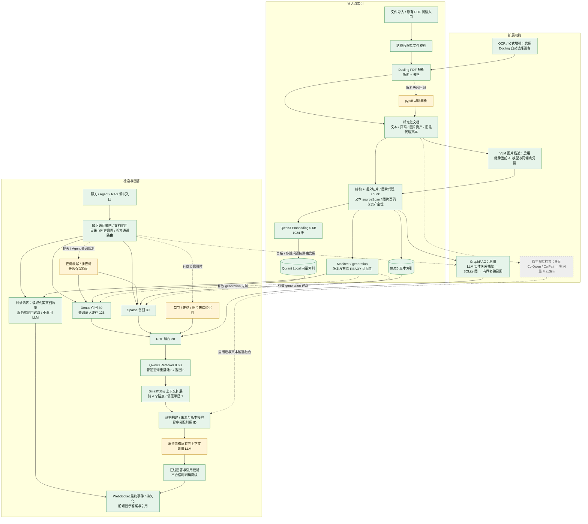

# 当前 RAG 架构与启用状态

核对日期：2026-10-01。依据当前工作区代码、`SettingsManager` 合并配置和环境变量解析结果；不是仅依据配置模型默认值，也不是对另一个已启动后端进程内存状态的探测。

**当前装配启用了文本混合 RAG、GraphRAG、OCR、公式增强、图片描述、查询路由、JIT 和查询嵌入缓存。三份现有资料均已发布文本和图索引：水箱论文 4 条关系、Measurement 8 条、任务书 2 条。两份资料的构图与导入阻塞已修复，验证详情见 [问题清单 OI-012](OPEN-ISSUES.md)。原生 ColQwen 视觉检索仍因资源限制关闭。**

图例：绿色 = 当前启用；黄色 = 按入口/条件触发；灰色虚线 = 实现存在但关闭。箭头表示数据或处理依赖。

DOCX、HTML、TXT/Markdown 等走各自基础解析器；Docling 高级解析当前针对 PDF。图片资产及图注代理文本提取在用，即使 VLM 和原生视觉检索关闭，图片代理仍可通过文本向量/BM25 召回。

## 状态清单

| 模块 | 当前状态 | 判断依据 / 触发条件 |
| --- | --- | --- |
| Docling 版面与表格解析 | 启用 | `advanced_parsing.enabled=true`，layout/table=true |
| pypdf | 条件使用 | Docling 失败时回退；单独关闭高级解析时作为主解析器 |
| 结构约束 + 语义切片 | 启用 | `semantic_chunking.enabled=true`；target 420、preferred 550、hard 750、overlap 80 |
| 图片提取、图注代理文本、页码定位 | 启用 | `parse_document` 的视觉元素补充和多模态代理 chunk 构建 |
| Qwen3 Embedding + Qdrant Local | 启用 | 0.6B、1024 维；文本及图片代理文本共用文本索引 |
| BM25 + RRF | 启用 | dense/sparse 各 30，融合 20 |
| Qwen3 Reranker | 启用，模型延迟加载 | 普通查询默认重排输入 8；章节查询会暴露完整融合池 |
| SmallToBig | 启用 | 前 4 个锚点扩展同章节邻居，半径 1，每锚点最多 1200 token |
| READY generation、删除/重建、来源校验 | 启用 | Manifest 控制有效版本；向量/BM25 按有效 generation 检索 |
| 查询改写/多查询 | 条件使用 | 聊天配置默认 rewrite=true；Agent 注册 QueryPlanner；底层 `retrieve()` 本身不改写，RAG 调试用无 LLM 的规划器 |
| 结构召回 | 条件使用 | 需要非空 `section_hints`；聊天层识别章节意图并传入，普通直接检索不自动触发 |
| 知识访问路由/范围控制 | 启用 | 聊天 `KnowledgeAccessRouter` 决定是否检索；Agent 校验可信文档范围 |
| 按问题类型切换 dense/sparse/graph 通道的 QueryRouter | 启用 | `query_router_enabled=true`；与知识访问路由是独立模块；Agent 知识工具仍使用其现有 QueryPlanner |
| GraphRAG 构图与多跳召回 | 启用，三份现有资料均有有效图 | `graph.enabled=true`；共 14 条关系通过来源核验；Measurement/任务书图召回、新资料导入与复用已验证；隔离资料两跳召回已跑通，完整效果验收仍保留 |
| OCR / 公式增强 | 启用 | 对应开关均 true，设备 auto；扫描文字与真实论文解析均已测试；公式语义准确率另需评测 |
| VLM 图片描述 | 启用 | `visual_understanding.enabled=true`；已验证当前 DeepSeek 图片调用与同端点凭据继承 |
| ColQwen/ColPali 原生视觉检索 | 实现存在，关闭 | `visual_retrieval.enabled=false`；独立多向量集合、MaxSim、prefetch 与自适应融合 |
| JIT search→read 按需读取 | 启用，Agent 入口 | `jit_search_read_enabled=true`；搜索给片段，read 工具给证据；聊天仍直接准备有界证据上下文 |
| 查询嵌入缓存 | 启用 | `embedding_cache_size=128`；按查询、范围、有效 generation 和嵌入版本隔离 |
| 检索通道/重排耗时预算 | 已配置预算 | 通道/重排均 30000ms，图 1000ms；包含协作截止与阶段耗时检查，不是对运行中计算的硬中断 |
| 在线回答与引用校验 | 已启用，原图需更正 | 聊天流式终结阶段使用 `AgentClaimEvidenceVerifier`；无效引用触发证据降级，部分支持会明确标注 |
| 离线 gold 断言校验辅助函数 | 仅用于评测 | `verify_claim_evidence` 需要评测断言和金标准，不应作为独立在线功能强行启用；它与上述在线校验不同 |
| 引用来源/ID/hash 校验 | 已接入 | `CitationService`、`validate_evidence_candidates`；不等同于断言的语义支持校验 |
| 最终上下文预算与 LLM 回答 | 消费者按需调用 | 聊天/调试使用 `GroundedContextBuilder`；Agent 消费工具证据。检索器本身不生成答案 |
| 调试、trace、坏例回放及效果评测 | 工具存在，按需使用 | RAG 调试 API/UI 与离线脚本，不是每次查询自动跑评测 |

## 关键代码入口

- [运行时与开关装配](D:/AITrans/backend/api/knowledge_dependencies.py)
- [配置定义](D:/AITrans/backend/rag/config.py)
- [导入与索引](D:/AITrans/backend/rag/index_service.py)
- [解析器路由](D:/AITrans/backend/rag/parsers/__init__.py)
- [检索、融合与重排](D:/AITrans/backend/rag/retrieval_service.py)
- [聊天层检索调用](D:/AITrans/backend/services/companion_chat_service.py)
- [Agent 知识工具](D:/AITrans/backend/agent_tools/knowledge.py)
- [在线回答与引用校验](D:/AITrans/backend/services/agent_claim_evidence_verifier.py)
- [流式回答终结与校验](D:/AITrans/backend/api/companion_stream.py)

本图记录装配状态，不表示已达到生产效果门槛。上一轮 PDF 的 Recall、MRR 和暖检索 P95 尚未达标，详见 [PDF 验证报告](D:/AITrans/docs/development/rag-production-luna/PDF-RAG-VALIDATION.md)。本轮启用原因、真实链路测试、数据迁移和未解决限制见 [验证报告](D:/AITrans/docs/development/rag-production-luna/RAG-ENABLEMENT-AND-CHAT-VALIDATION.md)。
