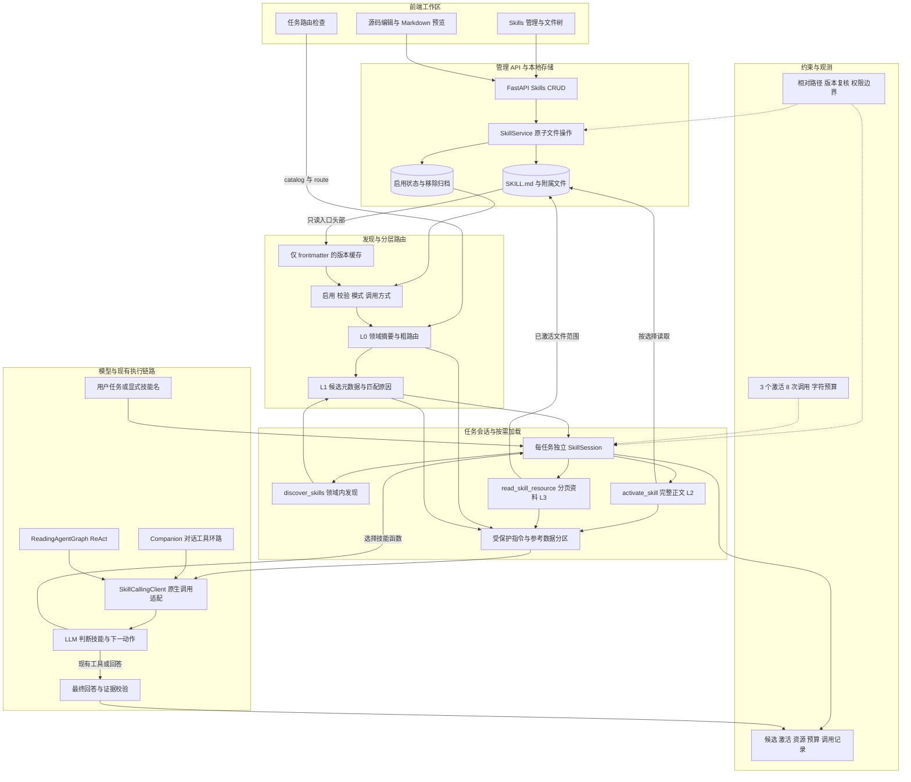
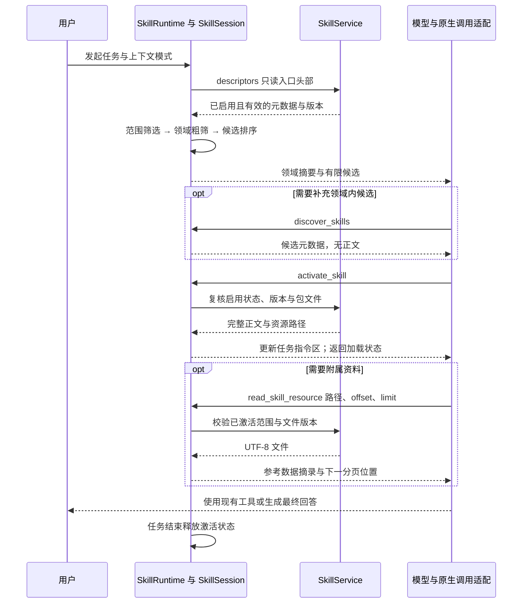

# AITrans Skill 分层路由与渐进式披露架构

**状态：已实现。** Skills 文件管理、路由检查、Companion 原生调用、Agent ReAct 决策和最终回答使用同一套 SkillRuntime。本文区分管理读取与运行时披露，图中的模块均对应实际代码。

## 📋 加载模型

Agent Skills 将内容分为发现时的元数据、激活时的指令正文和使用时的附属资源。[^1] AITrans 在这三层前增加领域摘要，形成四级导航；领域摘要不包含所有技能名或正文。

| 层次 | 披露内容 | 加载时机 | 选择职责 |
| --- | --- | --- | --- |
| **L0** | 领域名称、用途、数量 | 任务开始 | 服务端范围与领域粗筛 |
| **L1** | 名称、用途、分类、匹配原因 | 元数据短名单或领域发现 | 服务端排序，模型判断适用性 |
| **L2** | 完整 SKILL.md 正文、资源路径 | activate_skill 或用户显式指定 | 模型选择或用户选择 |
| **L3** | 一个附属文本的分页摘录 | read_skill_resource | 模型按当前任务需要选择 |

元数据匹配只产生候选，**不会自动激活正文**。模型可调用 `discover_skills` 浏览其他领域，从而补充粗筛结果；显式 `$paper-review` 或首行 `/paper-review` 会在首轮生成前尝试激活。停用、无效或不适用任务模式的技能，即使显式指定也不会加载。

## 📚 完整架构图

以下图的可维护源文件为 [skill-architecture.mmd](skill-architecture.mmd)；另提供可放大的 [SVG 架构图](skill-architecture.svg) 与 [PNG 架构图](skill-architecture.png)。



### 路由与加载时序



## ⚙️ 范围、分类与调用规则

范围先按 `enabled`、有效 frontmatter、`context_mode` 和调用方式过滤。领域为 `research`、`reading`、`writing`、`data`、`knowledge`、`general`。没有显式分类时，从名称和用途推断领域。任务粗筛最多取两个匹配领域并保留 general；未匹配到领域词时退回所有领域的元数据短名单。领域发现可补充其他领域，避免将粗筛当作最终权限判断。

可在标准字符串 metadata 内配置路由，无须修改正文格式：

```yaml
---
name: paper-review
description: 审阅论文的方法、证据和结论，适用于研究评审。
metadata:
  aitrans-category: research
  aitrans-triggers: "审稿,论文评审,peer review"
  aitrans-context-modes: "general,reading"
  aitrans-invocation: auto
---
# 工作流程
先确认研究问题，再检查方法与证据。
需要细则时读取 references/review-guide.md。
```

`aitrans-invocation: manual` 不进入自动领域目录或自动候选；用户显式指定时仍须满足启用、格式和模式要求。缺省为 auto。领域和模式字段影响发现范围，不改变现有工具权限。

## 💾 缓存与一致性

共享服务只缓存入口 frontmatter。缓存键包含修改时间、状态时间、字节数和文件身份；发现操作复核文件状态，发生变化后重新解析。运行时目录扫描只访问启用状态中登记的技能；没有读取所有正文或遍历资源目录。激活时才完整校验包结构并列出附属文件路径。

管理界面为编辑、校验和预览读取完整文件，与 Agent 的 L0/L1 发现接口独立。`GET /api/skills` 的管理校验可能读取正文；`catalog`、`route` 和 `descriptors` 不读取正文或资源。列表前端本身只接收摘要。

SkillSession 属于一个任务；AgentRunControl 持有该临时会话，多个 ReAct 决策与最终回答复用它，不写入持久化图检查点或跨任务缓存。恢复任务使用新的加载会话并重新校验技能。正文版本固定于激活时；停用、移除或更新后，从下一次上下文组装中清除相关正文和资料。

附属资源使用 SHA-256 版本和字符偏移分页。同一路径的后续页面若版本变化，清除旧摘录并拒绝新页面，要求重新发起任务。重复激活和完全相同的分页请求不会重复注入上下文。文件修改采用管理接口的乐观并发与原子替换，详情见 [文件管理 API](skill-system.md)。

## 🔐 预算与权限边界

| 约束 | 当前上限 | 超限处理 |
| --- | ---: | --- |
| 初始/单次领域候选 | 12 | 保留排序后的短名单 |
| 会话候选 ID | 24 | 收敛旧候选列表 |
| 同时激活 | 3 | 返回错误，不继续加载 |
| Skill 函数调用 | 8 | 停止提供 Skill 函数 |
| 候选 JSON 内容 | 4,000 字符 | 缩小披露列表 |
| 正文与路径 JSON 合计 | 12,000 字符 | 拒绝，正文不截断 |
| 资源 JSON 合计 | 8,000 字符 | 要求缩小摘录范围 |
| 单次资料正文 | 4,000 字符 | 分页读取 |
| 完整技能上下文 | 26,000 字符 | 拒绝继续加入内容 |

这是**字符预算**，没有把字符数量当作精确 token 数量。正文、路径、资源的 JSON 开销一并计入预算。指令区独立于普通阅读/工具文本压缩，防止已选工作流程被普通上下文裁剪；技能调用结果返回状态和路径，正文只注入指令区，资料只注入参考数据区。

指令低于系统规则和当前用户要求；附属资料为不可信数据。Skill 不会授权脚本运行、外部写入或绕过确认。路径与符号链接校验复用文件服务。知识库 NEVER 不阻止 Skill 加载；知识库 ALWAYS 和搜索后强制读取阶段只提供原有必选工具，Skill 加载不能代替证据读取或形成引用。

SkillCallingClient 包装现有原生调用接口。Skill 调用单独处理；其他调用仍由原知识库/ReAct 环路执行和计数。流式 Skill 调用的试探性文本暂存，确认最后一轮为回答后才释放，避免将工具选择期间的文字当作回答。单个 ReAct 决策包含多轮技能加载时使用至少 60 秒的决策窗口，仍受整次任务剩余时间约束；取消事件在原生对话适配层复核。

## 🌐 接口与可观测性

前端“路由检查”调用 `POST /api/skills/route`，返回领域目录、`selected_domains`、候选与原因、显式名称、诊断及 `body_loaded: false`。它不会替模型激活技能，也不会改变库状态。

模型函数为 `discover_skills(category, query)`、`activate_skill(skill_id)`、`read_skill_resource(skill_id, path, offset, limit)`。技能 ID enum 来自当前会话候选；资源只能属于已激活技能、位于包内且出现在激活后的文件清单。二进制资源不能注入模型上下文。

Companion 的调试元数据包含 `skills` 快照：目录版本、候选原因、激活文件版本、资源路径/偏移、原生调用 ID、调用状态、诊断和预算；不存入正文或资料文本。Agent 的 `DECISION_READY.skills` 事件也提供该快照，最终回答复用相同会话；前端尚未提供独立的 Skill 执行事件面板。独立的任务规划/多 Agent 专家图尚未各自加入 Skill 工具，已有工具选择与审批仍由其原执行链路管理。

## ✅ 实现与验证

| 模块 | 实现文件 |
| --- | --- |
| 文件管理与元数据缓存 | backend/services/skill_service.py |
| 范围与领域路由、会话加载 | backend/services/skill_runtime.py |
| 原生调用组合与流式处理 | backend/services/skill_function_bridge.py |
| 共享服务依赖 | backend/services/skill_dependencies.py |
| HTTP schema 与路由 | backend/models/skills.py、backend/api/skills.py |
| 对话接入 | backend/services/companion_chat_service.py |
| Agent 决策接入 | backend/agent_graph/reading_agent_graph.py、backend/services/agent_react_decision_service.py |
| 决策/回答会话复用 | backend/agent_core/reliability.py、backend/services/product_agent_service.py |
| 文件编辑与路由检查 | apps/desktop/src/features/skills/SkillWorkspace.tsx |
| 文件管理测试 | tests/test_skills.py |
| 加载与集成测试 | tests/test_skill_runtime.py |

验证覆盖元数据发现不读正文、缓存失效、任务隔离、手动技能、模式限制、显式调用、领域候选、正文完整性、分页/版本/预算、路径/二进制拒绝、原生模型调用、ReAct 会话复用和流式输出。原生集成测试使用可控模型客户端；未用真实付费模型验收语义选择质量。

## 🔗 参考

[^1]: Agent Skills specification 与 integration guide：<https://agentskills.io/specification>、<https://agentskills.io/integrate-skills>。三层披露与模型激活流程的外部依据；本项目的领域粗路由和预算为 AITrans 实现策略。
